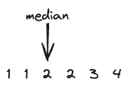

## [A. Median of an Array](https://codeforces.com/contest/1946/problem/A)

> **information**

diffcult : *480
tag: `implement`, `greedy`

> **summary**

$n$ 길이의 배열 $a$가 주어집니다. 
한번의 연산에 배열의 어떤 값  $a_i$ ($1 \le i \le n$)에 대해 1 증가 시킬 수 있고 이 연산은 몇 번이든 반복 할 수 있다.
배열의 중간 값($a_{\lceil \frac{n}{2} \rceil}$)을 증가시키기 위해 최소 몇 번의 연산을 수행해야하는가?

> **solve**

우선 $a$배열을 오름차순으로 정렬한다. $a = \{1, 2, 3, 4, 1, 2\}$

- 직관
	- 만약 $a_{\lceil \frac{n}{2} \rceil}$보다 크거나 같은 인덱스 중에 중간 값과 같은 가진 값의 개수를 구하면 최소 값이 나온다.

결국 위 예제에서 중간 인덱스 보다 크거나 같고 중간 값이랑 같은 값은 2개이다. 그러므로 2가 최소 연산 횟수이다.

- 증명
	- $a_{\lceil \frac{n}{2} \rceil}$를 $x$라 가정하자 연산이 1 더하는 연산이기 때문에 $x$는 $x + 1$이 되어야 한다. 즉, 중간 값이 바뀌기 위해서는 중간 인덱스보다 같거나 큰 인덱스의 값이 $x + 1$이 되어야 한다. $\lceil \frac{n}{2} \rceil$보다 크거나 같은 인덱스 중에 $x$와 같은 값을 가진 최대 인덱스를 $t$라고 하자 결국 $\lceil \frac{n}{2} \rceil \le i \le t$ 모든 구간에 대해 한번 씩 연산을 해주어야 한다. 즉 최소 $t - \lceil \frac{n}{2} \rceil + 1$ 번의 연산이 필요하다는 것을 알 수 있다.
