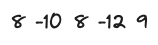

### [Maximum Sum](https://codeforces.com/contest/1946/problem/B)

> **information**

diffcult : \*1084
tag: `greedy`, `math`

> **summary**

$n$ 길이의 배열 $a$가 주어집니다.  
$k$번의 연산을 수행할 수 있습니다. 연산은 다음과 같습니다.
- 배열 $a$의 연속적인 부분 배열의 합을 구하고 이 합을 배열의 어디든 삽입할 수 있습니다. 
이 연산을 $k$번 수행했을 때 배열 $a$의 최대 합을 구해주세요.

값이 매우 커질 수 있으므로 modular $10^9 + 7$을 적용해주세요.

$1 \le n, k \le 2\cdot10^5$

> **solve**

일단 보자마자 최대 부분합을 어떻게 구할지 생각해보았다. 

1. 모든 부분합을 확인해보자 
	- 이 방법의 경우 $O(n^2)$ 이므로 시간내에 통과할 수 없다

2. 그리디하게 확인해보자
	- 처음부터 끝까지 배열을 순회하며 $i$ 를부분 배열의 마지막 인덱스라고 한다면 $x$부터 $i$
까지의 합이 음수라면 원래 배열의 합보다 작아진다는 사실을 알 수 있다. 처음 부분 배열을 $\{\}$ 으로 초기화 합니다 $0$부터 $n - 1$까지 순회하며 일단 $a_i$를 부분 배열에 추가한 후 만약에 합이 음수가 된다면 부분 배열을 빈 배열로 초기화합니다. 이 방법은 $O(n)$으로 부분 배열 최대합을 구할 수 있다.

부분 배열 최대합을 구한 후 최대 부분 배열 맨 뒤에 부분 배열 합을 삽입합니다. 그렇다면 부분 배열의 합은 하나가 추가될 때 마다 $2$배가 됩니다. 

위 배열이 있다고 가정해봅시다. 
1. i = 1, 8이 최댓값 입니다. {8}
2. i = 2, -10을 더하면 {2, -10} 합이 음수가 되므로 빈 배열로 초기화 {}
3. i = 3, 이전 부분 배열은 음수이므로 현재 인덱스만을 부분 배열을 가지는 것이 낫습니다. {8}
4. i = 4, 8 - 12는 음수입니다. 빈 배열로 초기화 합니다.{}
5. i = 5, 이전 부분 배열이 음수이므로 현재 인덱스만을 부분 배열로 가지는 것이 낫습니다. {9}

최대가 될 수 있는 부분 배열을 모아 봤을 때, 9가 최대인 것을 확인할 수 있습니다.

처음 배열의 합은 4입니다. $k = 2$
1. k = 1일 때, 9를 맨뒤에 삽입합니다.
2. k= 2일 때, 최대 부분 배열이 {9, 9}가 되었으므로 18을 삽입합니다.

즉 4 + 9 + 27 = 40이 최대값이 됩니다.