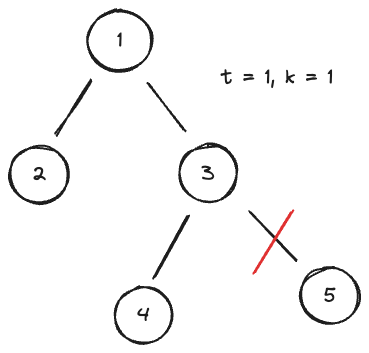
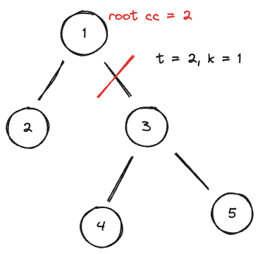
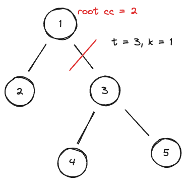
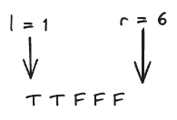
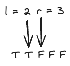

### [Tree Cutting](https://codeforces.com/contest/1946/problem/C)

> **information**

diffcult : \*1626
tag: `greedy`, `tree`, `parametric search`

> **summary**

$n$개의 정점을 가진 트리가 있습니다. 

$k$개의 간선을 잘라 최소 연결 요소의 개수 $x$가 가장 큰 $x$를 구하시오

> **solve**

정말 고민 많았던 문제다. 이것 저것 그려보며 한 정점의 자식이 몇개인지 알면 풀 수 있지 않을 까 생각했지만 그렇지 않았다. 

그러다가 최소 연결 요소의 개수를 $t$라고 한다면 리프 노드 부터 탐색하며 간선을 자르며 올라가 루트노드가 포함된 연결 요소의 개수가 $t$보다 크다면 최소 연결 요소의 개수 $t$가 가능하지 않을까 생각하였고. 이를 DFS를 통해 구할 수 있을거라 생각이 들었다.

하지만 정점의 개수가 $10^5$이기 때문에 $t$를 $1 \le i \le n$ 에 대해 탐색하면 $O(n^2)$이므로 매우 비효율적이다. 

여기서 특정 t가 작을 수록 루트가 포함된 연결요소의 크기가 커질 것이다. 리프 노드 부터 순차적으로 $t$보다 연결요소의 개수가 크거나 같으면 자르기 때문에 루트가 포함된 연결요소의 크기는 당연히 작아진다. 즉 $t$가 커지면 결국 최소 연결 요소의 개수가 $t$가 되는 경우는 없어진다. 이 말은 결국 이 문제를 결정문제라 볼 수 있고. $t$에 대해 파라메트릭 서치를 이용할 수 있다는 뜻이 된다.

이를 통해 시간 복잡도를 $O(nlogn)$으로 줄일 수 있다.

```text
5 1 n, k
1 2 간선 i
1 3
3 4
3 5
```

### $t = 1$



3과 5를 잇는 간선을 자를 수 있고 root의 연결요소가 4이므로 $t$보다 크다. 

### $t = 2$



1과 3을 잇는 간선을 잘라도 root의 연결요소는 2이므로 $t$랑 같다. $x = 2$가 될 수 있다.
### $t = 3$



하지만 1과 3을 자르면 root의 연결 요소는 3보다 작으므로 불가능하다. $t$가 3 이후로 부터는 불가능함을 알 수 있다.

결정 문제로 나타내보면 다음과 같다



이를 파라메트릭 서치를 이용하여 가장 큰 T의 값을 찾으면 된다



다음과 같이 나타낼 수 있으므로 $l$은 2가 된다 2가 즉 $x$의 최소 연결 개수의 최대 값이므로 답은 2가 된다.
